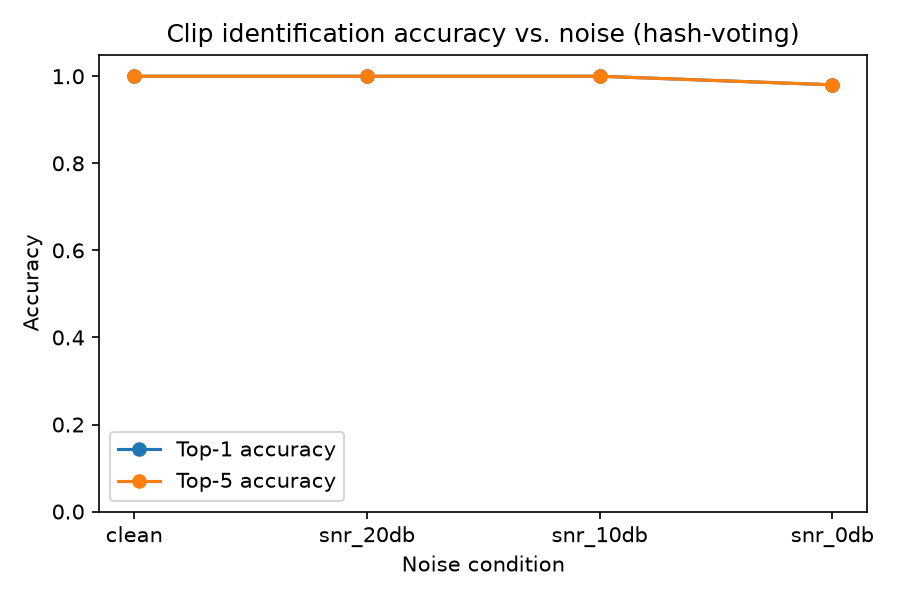
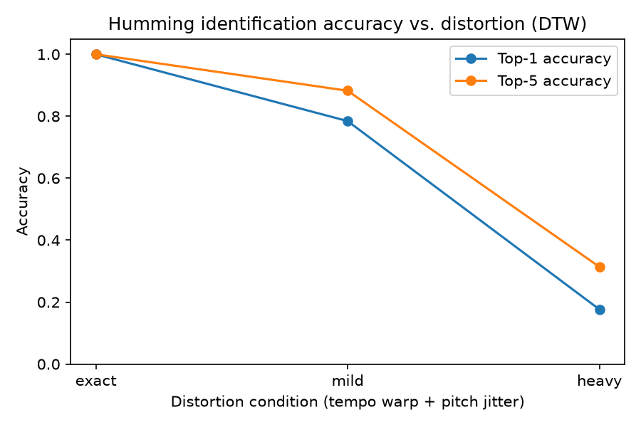
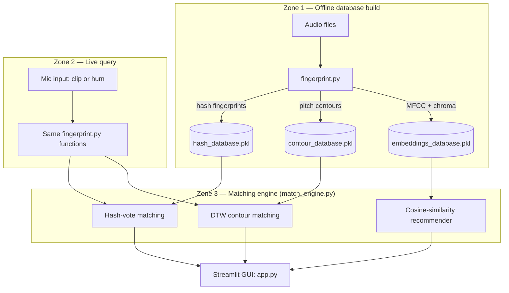
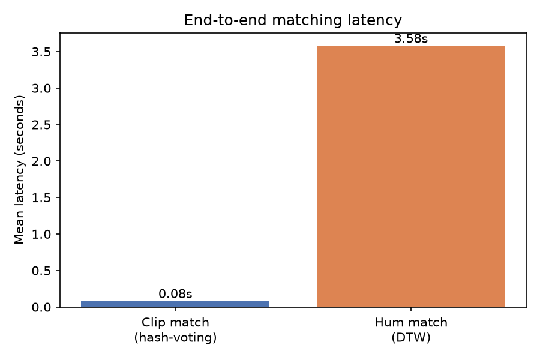

# 🎵 MusicComparison — Real-Time Audio Pattern Recognition for Music

Identify a song from either a **short audio clip** or from **humming/singing its melody**, then get **similar-song recommendations** — all running locally against a 52-song reference database, no cloud API involved.

Built as a university engineering project (audio signal processing / pattern recognition), then hardened past the assignment scope: the matching engine, evaluation, and GUI here are fully working and benchmarked, not just prototypes.

 

## What it does

Two independent identification paths, because "play a clip" and "hum the tune" are fundamentally different signals:

| Input | Technique | Why |
|---|---|---|
| 🎧 Exact clip (with background noise) | Spectrogram peak-hashing (Shazam-style) | Extremely fast, robust to noise, but requires the *exact* recording to be in the database |
| 🎤 Humming / singing | Pitch-contour extraction (pYIN) + subsequence DTW | Works from an approximate, tempo/pitch-imperfect rendition of the melody — no exact match needed |
| — | MFCC + chroma embeddings, cosine similarity | Recommends songs with similar timbre/harmony to whatever was just identified |

## Architecture



The same `fingerprint.py` functions run in both the offline database build and the live query path — the query has to be processed identically to what's in the database for matching to work.

## How the matching actually works

**Path A — hash-vote matching (`match_engine.match_clip`)**
Peaks are extracted from the spectrogram and paired up into `(freq1, freq2, Δtime)` hashes (classic Shazam approach). For every hash the query shares with a database song, we record the time offset between the query and the database occurrence. A real match produces one dominant, consistent offset (the clip's position within the song); noise/wrong songs produce scattered offsets. The song with the highest single-offset vote count wins.

**Path B — subsequence DTW matching (`match_engine.match_hum`)**
The melody is represented as frame-to-frame semitone deltas (key-invariant — hum it in any octave/key and the shape is the same). Rather than aligning the query end-to-end against a whole song, we use **subsequence DTW** (open-begin, open-end dynamic time warping) to find the best-matching *subsequence* anywhere in each song, in one DP pass. Lower normalized cost = better match.

**Recommendations (`match_engine.recommend`)**
Each song gets a 50-dim vector (mean+std of MFCC and chroma, L2-normalized). Cosine similarity (a plain dot product, since vectors are normalized) ranks the rest of the database against the identified song.

## Results

Evaluated on all 51 songs in the reference database (see [`evaluate.py`](evaluate.py) for methodology).

**Clip matching** — clean 10s clips, tested with additive white noise at decreasing SNR:

| Condition | Top-1 accuracy | Top-5 accuracy | Mean latency |
|---|---|---|---|
| Clean | 100% | 100% | 0.077s |
| 20dB SNR | 100% | 100% | 0.080s |
| 10dB SNR | 100% | 100% | 0.085s |
| 0dB SNR (very noisy) | 98.0% | 98.0% | 0.082s |

Hash-voting is essentially noise-proof down to 0dB SNR, and fast enough to feel instant.

**Humming matching** — DTW robustness to tempo warp (±10-20%) and pitch jitter (0.3-0.8 semitone noise) applied to ground-truth melody slices:

| Condition | Top-1 accuracy | Top-5 accuracy | Mean latency |
|---|---|---|---|
| Exact (no distortion) | 100% | 100% | 3.55s |
| Mild distortion | 78.4% | 88.2% | 3.64s |
| Heavy distortion | 17.6% | 31.4% | 3.55s |



Melody matching degrades gracefully with distortion, as expected, and is ~40x slower than hash-voting since it runs a DTW alignment against every song rather than a hash lookup — a direct consequence of comparing continuous sequences instead of discrete fingerprints.

> **Honesty note on the humming numbers:** these measure DTW's robustness to tempo/pitch distortion applied to each song's *own* ground-truth melody contour — not full mic → pitch-tracking → DTW accuracy on real human humming. Early testing showed pYIN (a monophonic pitch tracker) doesn't reliably isolate a melody line from *polyphonic* studio recordings — it tracks whatever's loudest, often instrumentation, not vocals. Real hummed input is monophonic (just a voice), so this isn't a synthetic-vs-real accuracy gap so much as a scoped claim: the numbers above isolate and validate the matching algorithm; real-world mic accuracy should be spot-checked live via `app.py` or `live_query.py`.

## Some real engineering problems hit along the way

Worth documenting because none of this showed up until actually measuring things:

1. **DTW was computationally infeasible at first.** An initial windowed-fastdtw approach (sliding a small window across each full song, pure-Python DTW per window) would have taken minutes per query across 51 songs. Switched to `librosa.sequence.dtw(subseq=True)` — one open-begin/open-end DP pass per song instead of dozens of windowed calls — and it dropped to ~4s/query.
2. **A "speed optimization" silently destroyed accuracy.** Downsampling (decimating) the pitch contours 4x before DTW seemed like a safe way to shrink the O(N·M) cost matrix. It wasn't: frame-to-frame pitch *deltas* alias badly once you skip frames — a missed note onset silently becomes a different melody shape. Top-1 accuracy on a clean self-match test dropped from 12/12 to 1/12. Verified with a decimation sweep (1/2/3/4x) before settling on full resolution as the only setting that preserves correctness at this database size.
3. **The evaluation script itself had a bug that looked like a matching bug.** An early "no distortion" baseline scored near 0% top-1 — which looked like the DTW matcher was broken. It was a typo in the test harness: the "exact" condition's tempo-warp range was accidentally set to allow up to ±100% random tempo warp instead of 0%. Fixed once isolated by testing the matcher directly against a known-good, zero-distortion contour slice (which correctly returned distance 0.0).

## Project structure

```
fingerprint.py          Core signal-processing: hashing, pitch contours, embeddings
build_metadata.py        Step 1: scan audio files -> metadata.csv (song_id, title, artist)
build_database.py        Step 2: build hash_database.pkl + contour_database.pkl
build_embeddings.py      Step 3: build embeddings_database.pkl (for recommendations)
match_engine.py           Matching engine: hash-vote, DTW, cosine-similarity recommender
live_query.py             CLI demo: record from mic -> fingerprint -> match -> print results
app.py                    Streamlit GUI: record -> identify -> show results + recommendations
evaluate.py                Performance evaluation: accuracy/latency across noise & distortion levels
```

## Running it yourself

The audio dataset (51 downloaded songs, ~3GB) and the resulting fingerprint databases are **not included** in this repo — they're copyrighted commercial music, and `hash_database.pkl` alone is ~180MB (over GitHub's 100MB file limit anyway). Everything is reproducible from your own local audio files:

```bash
python -m venv .venv
source .venv/bin/activate
pip install -r requirements.txt

# 1. Put your own .wav files in a database/ folder, then:
python build_metadata.py       # -> metadata.csv
python build_database.py       # -> hash_database.pkl, contour_database.pkl
python build_embeddings.py     # -> embeddings_database.pkl

# 2. Run the GUI
streamlit run app.py

# or the terminal demo
python live_query.py

# 3. Reproduce the evaluation
python evaluate.py
```

## Tech stack

`librosa` (STFT, pYIN pitch tracking, MFCC/chroma, subsequence DTW) · `numpy`/`scipy` (peak-picking, hashing) · `sounddevice`/`soundfile` (mic capture) · `streamlit` (GUI) · `pandas`/`matplotlib` (evaluation & charts)

## License

MIT — see [LICENSE](LICENSE). Covers the code only; no third-party music is distributed in this repository.
